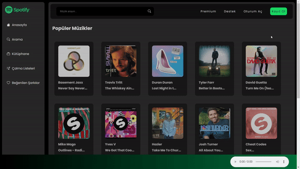
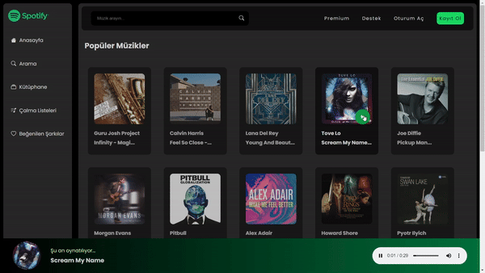

# Spotify Klonu

  

Bu proje, Spotify'ın temel işlevselliklerini taklit eden basit bir web uygulamasıdır. Uygulama, kullanıcıların müzik araması yapabilmesine, müzik oynatabilmesine ve ses seviyesini ayarlayabilmesine olanak tanır. Müzikler, bir API'ye bağlanarak çekilmektedir.

  

## Özellikler

- **Side Bar:** Sol tarafta, kullanıcıların farklı bölümlere erişebileceği bir yan menü bulunur.
- **Arama:** Kullanıcılar, üst kısımdaki arama çubuğunu kullanarak istedikleri müzikleri arayabilirler.
- **Müzik Oynatma:** Seçilen müzikler oynatılabilir.
- **Ses Kontrolü:** Kullanıcılar müziğin ses seviyesini ayarlayabilirler.

  

## Kullanılan Teknolojiler

- **HTML:** Uygulamanın temel yapısı için kullanıldı.
- **SCSS:** Daha düzenli ve sürdürülebilir CSS kodu yazmak için kullanıldı.
- **JavaScript:** Uygulamanın dinamik işlevselliklerini sağlamak için kullanıldı.

  

 

<a href="https://spotify-clonee-project.netlify.app/" style="font-size: 24px;color: green;">Web sitesini ziyaret etmek için tıklayınız</a>

  

